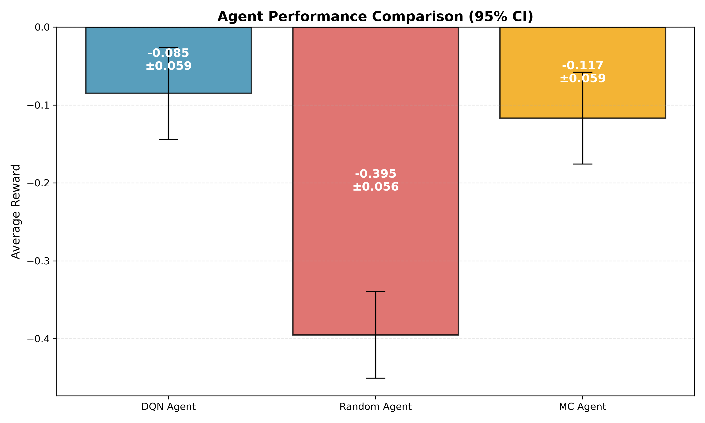

# Blackjack Reinforcement Learning

A comprehensive Reinforcement Learning project comparing Deep Q-Learning (DQN) and Monte Carlo (MC) methods for playing Blackjack, using the [RLCard](https://github.com/datamllab/rlcard) toolkit.

## 🎯 Project Overview

This project explores two distinct RL approaches to solving Blackjack:
1.  **Deep Q-Learning (DQN)**: A neural network-based approximate solution with Experience Replay.
2.  **Monte Carlo Control**: A tabular method learning directly from complete episodes.

We perform rigorous **hyperparameter tuning** and **statistical evaluation** to determine the most effective strategy.

## 📊 Results & Analysis

### 🏆 Agent Comparison

We evaluated each agent over **1,000 episodes**. The results highlight the statistical significance of valid strategies over random play.

| Agent | Average Reward | 95% Confidence Interval | Win Rate |
| :--- | :--- | :--- | :--- |
| **DQN Agent** | **-0.0850** | **± 0.0591** | **41.5%** |
| MC Agent | -0.1170 | ± 0.0590 | 40.1% |
| Random Agent | -0.3950 | ± 0.0556 | 28.3% |



### 🎛️ Hyperparameter Tuning (DQN)

We conducted a grid search to find the optimal DQN architecture. The simpler `[64, 64]` network outperformed deeper ones, likely due to the small state space of Blackjack preventing overfitting.

| Hidden Sizes | Learning Rate | Avg Reward | Win Rate |
| :--- | :--- | :--- | :--- |
| **[64, 64]** | **0.01** | **-0.1000** | **0.4300** |
| [64, 64, 64] | 0.001 | -0.1000 | 0.4400 |
| [64, 64] | 0.001 | -0.1800 | 0.3700 |
| [128, 128] | 0.01 | -0.2300 | 0.3700 |

## 🏗️ Methodologies

### 1. Deep Q-Network (DQN)
*   **Architecture**: Customizable MLP (default `[64, 64]`).
*   **Features**: Experience Replay (Buffer: 20,000), Target Network (Update: 10).
*   **Input**: Vector of [Player Sum, Dealer Card, Ace Status].

### 2. Monte Carlo (MC)
*   **Type**: On-Policy First-Visit MC Control.
*   **Update**: $Q(s,a) \leftarrow Avg(Returns)$.
*   **Pros**: Unbiased, simple to implement for episodic tasks.

## 🚀 Getting Started

### Installation

```bash
git clone https://github.com/Rohan-Siva/blackjack-rl.git
cd blackjack-rl
pip install -r requirements.txt
```

### 1. Hyperparameter Tuning (Recommended First Step)
Run a grid search to find the best DQN configuration. This automatically saves the best model and deletes the rest.

```bash
python -m src.tune_hyperparameters --num_episodes 2000
```

### 2. Training Individual Agents

**Train DQN**:
```bash
python -m src.train --hidden_sizes 64 64 --lr 0.01 --num_episodes 2000
```

**Train Monte Carlo**:
```bash
python -m src.train_mc --num_episodes 50000
```

### 3. Evaluation & Visualization
Generate the comparison plot and statistical metrics:

```bash
python -m src.evaluate --model_path models/tune_h64_64_lr0.01/dqn_agent.pth
```

### 4. Interactive Play
Play a game against your trained agent!

```bash
python -m src.play --model_path models/tune_h64_64_lr0.01/dqn_agent.pth
```

## 📁 Project Structure

```
poker-rl/
├── src/
│   ├── mc_agent.py          # Monte Carlo Agent implementation [NEW]
│   ├── tune_hyperparameters.py # Grid search orchestrator [NEW]
│   ├── train_mc.py          # MC training script [NEW]
│   ├── model.py             # Dynamic DQN architecture
│   ├── agent.py             # DQNAgent class
│   ├── evaluate.py          # Statistical evaluation & plotting
│   └── train.py             # DQN training script
├── models/                  # Checkpoints & metrics
├── visualizations/          # Plots (Training curves, Comparisons)
└── report.md                # Detailed project report
```

---
**License**: MIT
**Contact**: rohansiva123@gmail.com
